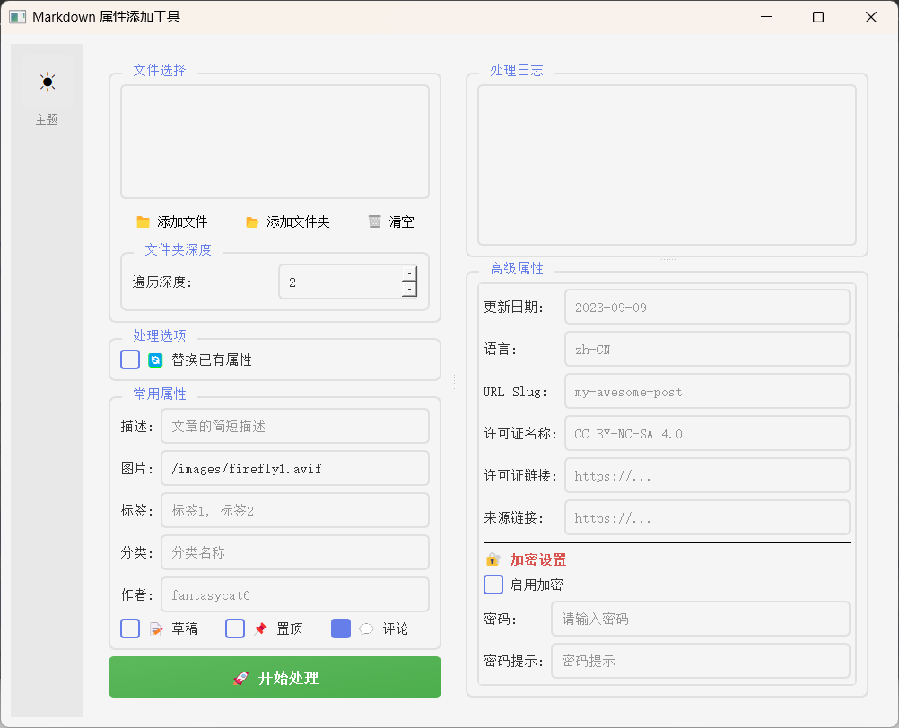
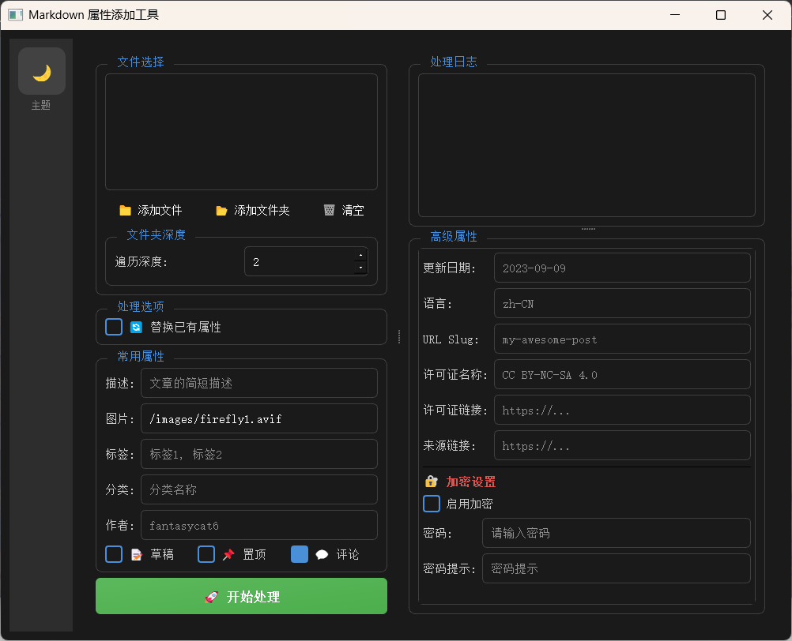

# MarkdownNoteAttributes_Add

A tool for managing frontmatter properties in Markdown files. This tool is designed to work with the [Firefly blog project](https://github.com/CuteLeaf/Firefly), helping you manage and modify note frontmatter properties efficiently.

## Features

- Add properties to Markdown files
- Batch processing support
- Custom properties support
- Theme switching (dark/light)
- Preserve existing published date when updating

## Screenshots

### Light Theme


### Dark Theme


## Requirements

- Python 3.x
- PyQt5

## Installation

```bash
git clone https://github.com/fantasycat6/MarkdownNoteAttributes_Add.git
cd MarkdownNoteAttributes_Add

pip install -r requirements.txt
```

## Usage

```bash
python main.py
```

Or run `start.bat` on Windows.

## Properties

Default properties added:
- title: Extracted from first heading
- published: File modification date
- updated: Current date
- description: Short description
- image: Image path
- tags: List of tags
- category: Category name
- author: Author name
- draft: Draft status
- pinned: Pinned status

Optional properties:
- password: Password protection
- passwordHint: Password hint
- lang: Language code
- urlSlug: URL slug
- licenseName: License name
- licenseUrl: License URL
- sourceLink: Source link